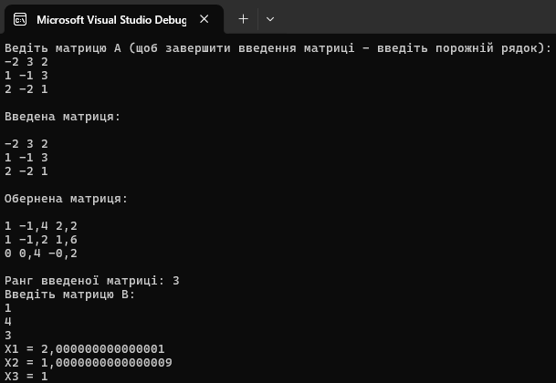

# АСППР Lab1 Варіант 18
## Виконання частини A першої практичної роботи
В даній частині практичної роботи було програмно реалізовано знаходження рангу матриці, оберненої матриці а також знаходження розв'язків після введення матриці В. Обчислення можуть бути виконані лише для **квадратної** матриці (для прямокутних матриць обчислюється лише їх ранг).

Обчислення оберненої матриці, як і рангу матриці, відбуваються за допомогою виконання алгоритму Звичайних Жорданових Виключень, в ході яких обчислюється обернана матриця (за умови що першопочаткова матриця є квадратною), а також ранг. 

Нижче наведено виконання обсчислень свого варіанта:

