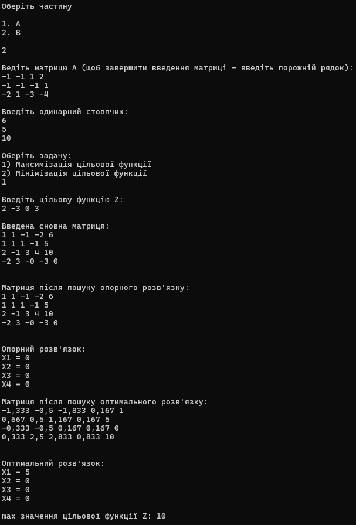
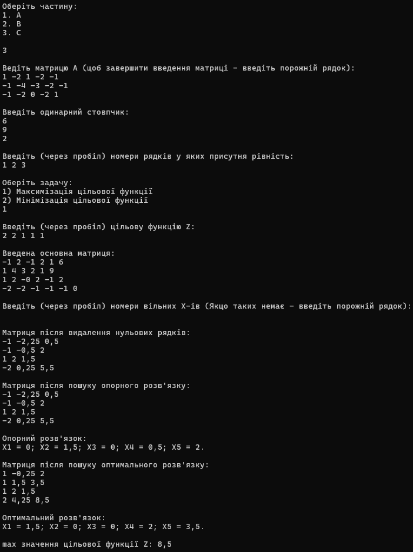
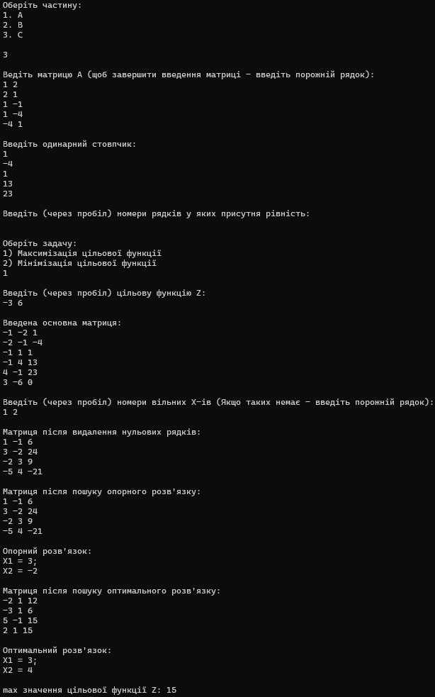

# АСППР Lab1 Варіант 18
## Виконання частини A практичної роботи
В даній частині практичної роботи було програмно реалізовано знаходження рангу матриці, оберненої матриці а також знаходження розв'язків після введення матриці В. Обчислення можуть бути виконані лише для **квадратної** матриці (для прямокутних матриць обчислюється лише їх ранг).

Обчислення оберненої матриці, як і рангу матриці, відбуваються за допомогою виконання алгоритму Звичайних Жорданових Виключень, в ході яких обчислюється обернана матриця (за умови що першопочаткова матриця є квадратною), а також ранг. 

Нижче наведено виконання обсчислень свого варіанта:

## Виконання  частини B практичної роботи
В другий частині практичної роботи було реалізовано знаходження опорного та оптимального розв'язків (за їх наявності) матриці за допомогою модифікованих Жорданових виключень, а також знаходження максимуму або мінімуму цільової функції. Вводити матрицю слід після зміни знаків в результаті зміни <= на >= в рядках першопочаткової системи.

Нижче наведено виконання обсчислень свого варіанта:

## Виконання  частини C практичної роботи
В третій частині практичної роботи було реалізовано знаходження опорного та оптимального розв'язків (за їх наявності) матриці за допомогою модифікованих Жорданових виключень, а також знаходження максимуму або мінімуму цільової функції, при умові наявності нульових рядків. Для цього алгоритм частини B було змінено. В алгоритм, перед основною частиною знаходження розв'язків, було додано алгоритм перенесення нульових рядків нагору в результаті виконання МЖВ, на місце X-ів, а також видалення нульових стовпців. 

Далі було реалізовано виключення вільних змінних. Для цього було створено класи видаленого рядка та елемента видаленого рядка. Клас рядка містив в собі індекс, що характеризував видалений Х, масив об'єктів класу елементів, а також обчислюване значення, яке використовується для пошуку X-ів у формули яких воно входить. 
Після перенесення вільних X-ів вліво, формула додається у масив об'єктів класу видалених рядків, звідки виористовується при пошуку опорного та оптимального розв'язків. Після чого рядок видаляється з матриці, і алгоритм переходить до наступного етапу.

Приклад роботи програми за умови наявності нульових рядків, а також за умови наявності вільних змінних - наведено на рисунках нижче відповідно:

